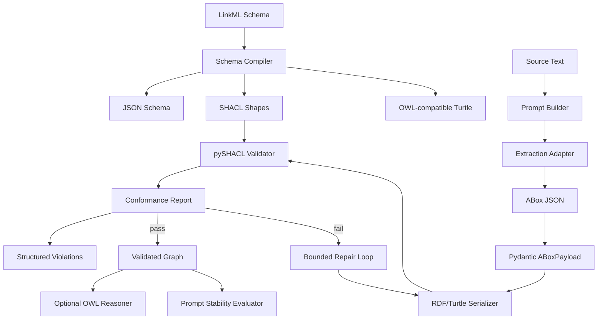

# NeuroOntoGen

NeuroOntoGen is an SDK-first research project for building ontology-generation pipelines that do not trust raw LLM output as the final source of truth.

The project combines flexible extraction with symbolic validation. LLMs can propose ABox facts, but LinkML, Pydantic, RDF, and SHACL define the contract that decides whether those facts are usable.

> Current status: early MVP. The implemented core covers schema compilation, typed ABox models, raw JSON extraction normalization, schema-constrained prompt construction, hosted and local provider adapters, RDF/Turtle serialization, SHACL validation, structured SHACL violation parsing, bounded LLM-backed repair orchestration, optional OWL reasoner availability/consistency checks and repair, cross-prompt RDF graph stability evaluation, clustering-based schema discovery with optional LLM cluster naming, local in-memory graph repository smoke queries, read/query-only remote SPARQL endpoint adapters, and smoke-testable CLI commands. MCP adapters remain planned.

## Why this exists

LLMs are useful for reading unstructured text, but they are weak at maintaining ontology discipline by themselves. Common failure modes include:

- inventing entities or relations that are not in the schema;
- mixing classes, instances, and properties;
- omitting required fields;
- changing graph structure when the prompt wording changes;
- producing triples that look plausible but cannot be validated.

NeuroOntoGen treats the LLM as a proposal engine, not as the validator. The validator is code.

## Core idea

```text
LinkML schema
  -> JSON Schema / SHACL / OWL-compatible Turtle artifacts

Typed ABox payload
  -> RDF/Turtle
  -> pySHACL validation
  -> conformance report
```

The project now includes two CompanyAccess schema tracks:

- `schemas/company_schema.yaml`: production-scale starter TBox with `CompanyEntity`, `Person`, `Employee`, `Contractor`, `Department`, `SecureAsset`, `DigitalAsset`, `PhysicalAsset`, and `AccessPolicy`, including inheritance, domain/range constraints, and required/cardinality constraints.
- `tests/fixtures/company_schema.yaml`: intentionally minimal fixture used by deterministic unit tests and examples.

The typed ABox payload covers the extraction MVP subset and the current production schema classes (`Person`, `Employee`, `Contractor`, `Department`, `SecureAsset`, `DigitalAsset`, `PhysicalAsset`, and `AccessPolicy`) with schema-aligned object properties (`memberOf`, `manages`, `operates`, `assignedPolicy`, `managedBy`, and `ownerDepartment`).

## What is implemented now

| Area | Status | Notes |
|---|---:|---|
| Python package skeleton | Implemented | Standard `src/` layout with editable install support. |
| LinkML schema fixture | Implemented | `schemas/company_schema.yaml` is a production-scale starter TBox; `tests/fixtures/company_schema.yaml` remains the minimal deterministic fixture. |
| Schema compiler wrapper | Implemented | Generates JSON Schema, SHACL, and Turtle artifacts. |
| Pydantic ABox models | Implemented | Validates production-schema-aligned people, departments, policies, secure/digital/physical assets, and predicate-specific relation endpoints while preserving the original Employee/SecureAsset MVP path. |
| RDF/Turtle serializer | Implemented | Converts typed ABox payloads into parseable Turtle, including extended CompanyOntology classes and object properties. |
| SHACL validation loop | Implemented | Valid and invalid graphs are tested against generated SHACL. |
| Structured SHACL violation parser | Implemented | Validation report graphs are parsed into repair-ready violation objects. |
| Bounded self-repair controller | Implemented | Fake repairer tests cover success, already-valid passthrough, hard failure after retry limits, and repairer exceptions. |
| LLM Turtle repairer | Implemented | Builds repair prompts from structured SHACL violations, calls a completion provider, strips accidental Turtle fences, and revalidates through the bounded controller. |
| CLI | Implemented | Typer commands compile schemas, validate Turtle graphs, extract ABox JSON, repair SHACL-invalid Turtle graphs, repair OWL-inconsistent Turtle graphs, and run optional OWL checks. |
| Runnable examples | Implemented | `examples/company/` includes conforming and non-conforming Turtle smoke fixtures. |
| GitHub Actions CI | Implemented | Runs install, Ruff, pytest, and CLI smoke checks on push and pull request. |
| Benchmark skeleton | Implemented | Quick benchmark emits JSON and optional Markdown summaries for the company examples. |
| End-to-end notebook | Implemented | Executable reviewer/demo notebook covers schema compilation, ABox serialization, SHACL validation, violation inspection, and bounded mock repair. |
| Raw extraction normalization | Implemented | JSON-like provider output can be parsed into a validated `ABoxPayload`. |
| Schema-constrained prompt builder | Implemented | Versioned prompt artifacts expose role, context, normalization, ontology specification, source text, and output schema sections. |
| Provider-backed extraction boundary | Implemented | A protocol-based adapter builds prompts, calls a provider client, and validates provider output. |
| Xiaomi MiMo provider integration | Parked | Adapter remains in the codebase, but default extraction/repair flows are now DeepSeek-first while Xiaomi credentials are unavailable. |
| DeepSeek provider integration | Implemented | OpenAI-compatible `deepseek-v4-pro` adapter using `DEEPSEEK_API_KEY`, `DEEPSEEK_BASE_URL`, and `DEEPSEEK_MODEL`; default for extraction and usable by repair. |
| Generic OpenAI-compatible relay integration | Implemented | `--provider openai-compatible` uses `OPENAI_API_KEY`, `OPENAI_BASE_URL`, `OPENAI_MODEL`, `OPENAI_TIMEOUT`, `OPENAI_MAX_RETRIES`, and `OPENAI_RETRY_DELAY` for OpenAI-style relay endpoints. |
| Anthropic provider integration | Implemented | `--provider anthropic` / `--provider claude` uses `ANTHROPIC_API_KEY`, `ANTHROPIC_BASE_URL`, `ANTHROPIC_MODEL`, `ANTHROPIC_TIMEOUT`, `ANTHROPIC_MAX_RETRIES`, and `ANTHROPIC_RETRY_DELAY` through the Messages API without adding a mandatory SDK dependency. |
| Local model provider integration | Implemented | `--provider local-model` / `--provider ollama` targets local OpenAI-compatible `/v1/chat/completions` servers such as Ollama, vLLM, llama.cpp server, or LM Studio via `LOCAL_MODEL_*`; API key is optional. |
| Production LLM SDK integration | Partially implemented | OpenAI-compatible provider base supports DeepSeek, generic relay endpoints, retryable HTTP/network failures, provider request IDs, `Retry-After` backoff hints, plus parked Xiaomi MiMo; Anthropic Messages API and local model servers are wired through the same provider-neutral boundary, and OpenAI-compatible/Anthropic retry behavior now reuses one shared helper. |
| Repair failure taxonomy | Implemented | Repair failures carry machine-readable reasons and error messages. |
| OWL reasoning | Optional adapter implemented | Lazy owlready2/Pellet/HermiT boundary with clear unavailable status when Java or optional deps are missing; `repair-owl` wraps OWL diagnostics, LLM repair, and bounded re-reasoning. |
| Prompt stability evaluation | Implemented | Compares parseable Turtle outputs across prompt variants using canonical RDF triples, consensus graph coverage, and per-variant precision/recall/F1 diagnostics. |
| Clustering discovery | Implemented | Deterministic fallback plus optional SpaCy noun-chunk extraction, sentence-transformer embeddings, scikit-learn AffinityPropagation clustering, optional LLM-based cluster naming, human-review flags, and LinkML draft generation. |
| Graph repository connector | Implemented | Local RDFLib in-memory repository loads Turtle, runs SELECT/CONSTRUCT/ASK SPARQL, exports Turtle, and opens no network connection by default; `SPARQLEndpointRepository` adds read/query-only remote endpoint support through an injectable HTTP seam. |

## Architecture



The current code implements the solid arrows. Dotted arrows are planned MVP extensions.

## Installation

Clone the repository and install it in editable mode:

```bash
git clone https://github.com/sinonchum/NeuroOntoGen.git
cd NeuroOntoGen
python -m venv .venv
source .venv/bin/activate
python -m pip install -e '.[dev]'
```

The project requires Python 3.10 or newer.

## Quick start

### Compile a LinkML schema

```python
from pathlib import Path

from neuro_onto_gen.schema.compiler import compile_schema

artifacts = compile_schema(
    schema_path=Path("schemas/company_schema.yaml"),
    output_dir=Path("build/schema"),
)

print(artifacts)
```

Expected artifact keys:

```text
json_schema
shacl
turtle
```

### Build and serialize a typed ABox payload

```python
from neuro_onto_gen.core.models import (
    ABoxPayload,
    ExtractedEmployee,
    ExtractedRelation,
    ExtractedSecureAsset,
)
from neuro_onto_gen.core.serializer import serialize_abox_to_turtle

payload = ABoxPayload(
    employees=[ExtractedEmployee(emp_id="E-001", has_access_level=3)],
    secure_assets=[ExtractedSecureAsset(asset_id="VPN", required_clearance=2)],
    relations=[
        ExtractedRelation(
            subject_emp_id="E-001",
            predicate="operates",
            object_asset_id="VPN",
        )
    ],
)

turtle = serialize_abox_to_turtle(payload)
print(turtle)
```

### Validate Turtle against generated SHACL

```python
from pathlib import Path

from neuro_onto_gen.core.validation import validate_abox_turtle
from neuro_onto_gen.schema.compiler import compile_schema

artifacts = compile_schema(Path("schemas/company_schema.yaml"), Path("build/schema"))
report = validate_abox_turtle(turtle, artifacts["shacl"])

print(report.conforms)
print(report.report_text)
```

A valid payload should return `conforms == True`. A graph missing a required property, such as `requiredClearance` on `SecureAsset`, should return `conforms == False` with a SHACL report.

### Use the CLI smoke commands

Compile a schema from the command line:

```bash
neuro-onto-gen compile-schema schemas/company_schema.yaml build/schema
```

Validate a Turtle data graph against generated SHACL shapes:

```bash
neuro-onto-gen validate-turtle examples/company/valid_abox.ttl build/schema/company_schema.shacl.ttl
```

The validation command prints `conforms: true` and exits `0` for conforming graphs. For non-conforming graphs, such as `examples/company/invalid_abox.ttl`, it prints structured violation details and exits `1`.

Extract source text with the default DeepSeek OpenAI-compatible provider:

```bash
export DEEPSEEK_API_KEY="..."
export DEEPSEEK_BASE_URL="https://api.deepseek.com/v1"
export DEEPSEEK_MODEL="deepseek-v4-pro"
neuro-onto-gen extract "Employee E-001 has access level 3 and operates secure asset VPN requiring clearance 2."
```

Or use a generic OpenAI-compatible relay endpoint:

```bash
export OPENAI_API_KEY="..."
export OPENAI_BASE_URL="https://api.shqbb.com/v1"
export OPENAI_MODEL="gpt-4o-mini"
export OPENAI_MAX_RETRIES="2"
neuro-onto-gen extract "Employee E-001 has access level 3 and operates secure asset VPN requiring clearance 2." --provider openai-compatible
```

Or use Anthropic's Messages API through the same provider-neutral boundary:

```bash
export ANTHROPIC_API_KEY="..."
export ANTHROPIC_MODEL="claude-3-5-haiku-latest"
export ANTHROPIC_MAX_RETRIES="2"
neuro-onto-gen extract "Employee E-001 has access level 3 and operates secure asset VPN requiring clearance 2." --provider anthropic
```

Or target a local/private OpenAI-compatible model server such as Ollama, vLLM, llama.cpp server, or LM Studio. Authentication is optional for this adapter:

```bash
export LOCAL_MODEL_BASE_URL="http://localhost:11434/v1"
export LOCAL_MODEL_MODEL="llama3.1:8b"
neuro-onto-gen extract "Employee E-001 has access level 3 and operates secure asset VPN requiring clearance 2." --provider local-model
```

If your local/private endpoint requires a bearer token, also set:

```bash
export LOCAL_MODEL_API_KEY="..."
```

Xiaomi MiMo is temporarily parked because the available credential currently returns `401 invalid_key`; its adapter remains available for explicit experiments with a valid key via `--provider xiaomi-mimo`.

The `extract` command renders the schema-constrained CompanyAccess prompt, calls the selected provider endpoint, and prints only Pydantic-validated ABox JSON. Missing provider configuration exits `2`; provider HTTP/shape errors exit `3`; schema validation failures exit `4`.

Repair a non-conforming Turtle graph with the same provider boundary:

```bash
neuro-onto-gen repair-turtle examples/company/invalid_abox.ttl build/schema/company_schema.shacl.ttl --provider openai-compatible --max-attempts 2
```

The repair command parses real SHACL violations, builds a repair prompt, calls the provider, strips accidental Turtle fences, revalidates each candidate, prints only the final conforming Turtle, and exits `5` if the bounded repair loop cannot converge.

Run an optional OWL consistency check:

```bash
neuro-onto-gen reason-owl path/to/ontology.ttl
```

The command exits `2` with a clear install hint when optional OWL dependencies or Java are unavailable. Inconsistent OWL reports can also be repaired through the LLM provider boundary and rechecked by the reasoner:

```bash
neuro-onto-gen repair-owl path/to/ontology.ttl --provider deepseek --max-attempts 2
```

`repair-owl` converts inconsistent reasoner reports into `OwlRepairDiagnostic` objects, passes them through the same Turtle repair prompt, reruns the OWL reasoner after each candidate, prints only the final consistent Turtle, and exits `5` if the bounded loop cannot converge. To enable Pellet/HermiT-backed reasoning locally:

```bash
python -m pip install -e '.[owl]'
java -version
```

### Run the benchmark skeleton

```bash
python benchmarks/run_benchmark.py --dataset examples/company --quick
```

The quick benchmark emits a JSON summary with case-level SHACL reports, SHACL conformance rate, and deterministic prompt-stability diagnostics over Turtle prompt-variant outputs. Repair metrics remain placeholders until production repairers are added.

### Execute the end-to-end notebook

```bash
jupyter nbconvert --to notebook --execute notebooks/end_to_end_demo.ipynb --output /tmp/neuro_onto_gen_demo.ipynb
```

The notebook is deterministic and uses a mock repairer, so it does not require production LLM credentials.

### Optional LLM cluster naming

Cold-start schema discovery can keep deterministic exemplar-derived labels or use an injected provider-backed namer:

```python
from neuro_onto_gen.clustering import LlmClusterNamer, discover_schema_from_terms
from neuro_onto_gen.providers import DeepSeekProvider

report = discover_schema_from_terms(
    ["Company", "Organization", "Employer"],
    embeddings={
        "Company": [1.0, 0.0],
        "Organization": [0.96, 0.04],
        "Employer": [0.92, 0.08],
    },
    cluster_namer=LlmClusterNamer(
        provider=DeepSeekProvider.from_env(),
        ontology_name="CompanyAccess",
    ),
)
```

`LlmClusterNamer` asks for exactly one PascalCase class label, strips accidental Markdown fences, records the naming backend in the report, and keeps the generated LinkML draft marked as requiring human ontology review.

### Local graph repository smoke queries

The repository boundary starts with a safe local adapter that does not open network connections:

```python
from neuro_onto_gen.graph import InMemoryGraphRepository

repository = InMemoryGraphRepository().load_turtle(turtle, graph_name="company-example")
result = repository.query("""
PREFIX ex: <http://example.org/company/>
SELECT ?employee ?asset WHERE {
    ?employee a ex:Employee ;
              ex:operates ?asset .
}
""")

print(result.rows)
```

`InMemoryGraphRepository` is intended for deterministic smoke tests, local demos, and future connector-contract tests before remote GraphDB/Fuseki/Neptune/SPARQL-endpoint adapters are added.

For read/query-only remote endpoints, use the SPARQL adapter. Construction is side-effect free; network I/O happens only when `query()` is called, and tests can inject a fake HTTP client:

```python
from neuro_onto_gen.graph import SPARQLEndpointRepository

repository = SPARQLEndpointRepository(endpoint_url="https://graph.example/sparql")
result = repository.query("""
PREFIX ex: <http://example.org/company/>
SELECT ?employee WHERE { ?employee a ex:Employee }
""")
```

Remote Turtle loading/update is intentionally not implemented yet; adding writes requires an explicit SPARQL Update endpoint contract and safety policy.

## Development

Run the test suite:

```bash
.venv/bin/python -m pytest -q
```

Run linting:

```bash
.venv/bin/ruff check .
```

Current local verification target:

```text
91 passed
All checks passed
Notebook execution succeeds with nbconvert
GitHub Actions CI succeeds on `main`
```

## Repository layout

```text
NeuroOntoGen/
|-- .github/
|   `-- workflows/
|       `-- ci.yml
|-- benchmarks/
|   |-- README.md
|   `-- run_benchmark.py
|-- examples/
|   `-- company/
|       |-- README.md
|       |-- invalid_abox.ttl
|       `-- valid_abox.ttl
|-- docs/
|   |-- DEVELOPMENT_ROADMAP.md
|   |-- PRD.md
|   `-- TECHNICAL_ARCHITECTURE.md
|-- notebooks/
|   `-- end_to_end_demo.ipynb
|-- schemas/
|   `-- company_schema.yaml
|-- src/
|   `-- neuro_onto_gen/
|       |-- cli.py
|       |-- clustering/
|       |   |-- __init__.py
|       |   `-- discovery.py
|       |-- core/
|       |   |-- models.py
|       |   |-- owl_reasoner.py
|       |   |-- prompting.py
|       |   |-- repair.py
|       |   |-- serializer.py
|       |   `-- validation.py
|       |-- evaluation/
|       |   |-- metrics.py
|       |   `-- prompt_stability.py
|       |-- graph/
|       |   |-- __init__.py
|       |   `-- repository.py
|       |-- providers/
|       |   |-- __init__.py
|       |   |-- deepseek.py
|       |   |-- openai_compatible.py
|       |   `-- xiaomi_mimo.py
|       `-- schema/
|           `-- compiler.py
|-- tests/
|   |-- fixtures/
|   |   `-- company_schema.yaml
|   |-- test_benchmark_runner.py
|   |-- test_ci_workflow.py
|   |-- test_cli.py
|   |-- test_core_models.py
|   |-- test_core_serializer.py
|   |-- test_evaluation_metrics.py
|   |-- test_examples.py
|   |-- test_notebook_demo.py
|   |-- test_owl_reasoner.py
|   |-- test_package_import.py
|   |-- test_schema_compiler.py
|   `-- test_shacl_validation.py
`-- pyproject.toml
```

## Design principles

1. Schema first. LinkML and Pydantic define the contract before any model provider is added.
2. LLMs do not validate themselves. Model output must pass deterministic checks.
3. SHACL before persistence. Non-conformant graphs should not enter downstream storage.
4. Repair must be bounded. Automatic repair should have retry limits and clear failure states.
5. SDK before CLI and MCP. Core behavior should be testable as a Python library before it is exposed through adapters.

## Roadmap

### Phase 1: Schema compilation baseline

Implemented:

- Python package skeleton;
- LinkML company schema;
- JSON Schema, SHACL, and Turtle artifact generation;
- tests for generated artifacts.

### Phase 2: ABox modeling and RDF serialization

Partially implemented:

- typed ABox models;
- raw extraction JSON normalization;
- schema-constrained extraction prompt builder;
- provider-backed extraction adapter boundary;
- Xiaomi MiMo `mimo-v2.5-pro` OpenAI-compatible provider adapter;
- DeepSeek `deepseek-v4-pro` OpenAI-compatible provider adapter;
- CLI `extract` command for provider-backed validated ABox JSON;
- relation endpoint validation;
- deterministic Turtle serialization;
- RDF graph assertions in tests.

Next:

- provider-specific quota telemetry beyond standard request ID and `Retry-After` diagnostics;
- optional real-provider smoke recipes for local Ollama/vLLM and hosted endpoints without committing credentials.

### Phase 3: Validation and repair

Implemented:

- pySHACL validation helper;
- structured violation parser;
- bounded self-repair controller with fake repairer tests;
- LLM Turtle repairer that builds prompts from structured SHACL diagnostics;
- `repair-turtle` CLI command with provider-backed revalidation loop;
- repair failure taxonomy;
- valid and invalid graph tests.

Next:

- richer repair policy selection.

### Phase 4: Reasoning and evaluation

Implemented:

- optional OWL reasoner adapter with lazy dependency checks and CLI unavailable-state reporting;
- OWL inconsistency diagnostics plus bounded `OwlRepairController` revalidation loop;
- clustering-based schema discovery with deterministic fallback plus optional SpaCy / sentence-transformer / scikit-learn AffinityPropagation adapters;
- optional provider-backed `LlmClusterNamer` for review-safe PascalCase cluster labels;
- prompt-stability evaluation with RDF graph canonicalization and graph-level diagnostics;
- local RDFLib `InMemoryGraphRepository` smoke adapter for SELECT/CONSTRUCT/ASK queries;
- read/query-only `SPARQLEndpointRepository` with injectable HTTP client seam and normalized SELECT/ASK JSON plus CONSTRUCT Turtle results.

Planned:

- SPARQL Update / authenticated write adapters for GraphDB/Fuseki/Neptune after explicit safety policy.

### Phase 5: Usability layer

Partially implemented:

- CLI smoke commands for schema compilation and Turtle validation;
- runnable company example fixtures for conforming and non-conforming Turtle graphs;
- GitHub Actions CI for install, lint, tests, and CLI smoke checks;
- benchmark skeleton with quick JSON and Markdown summaries, including Exact Match and Fuzzy Token F1 against the valid example reference;
- reproducible end-to-end notebook with deterministic mock repair;

Planned:

- production LLM-backed notebook variants after provider adapters exist;

## Documentation

The current planning documents are in `docs/`:

- `docs/PRD.md` - product requirements and target use cases;
- `docs/TECHNICAL_ARCHITECTURE.md` - system design and implementation notes;
- `docs/DEVELOPMENT_ROADMAP.md` - staged engineering roadmap.

Some of these documents are still design drafts and may describe planned features that are not implemented yet. The README status table above is the source of truth for current code capability.

## Current limitations

- Xiaomi MiMo is parked until valid credentials/endpoint access are available; DeepSeek is the default OpenAI-compatible provider for local smoke paths.
- OpenAI-compatible retry/backoff covers retryable HTTP/network failures and honors provider `Retry-After`; richer provider-specific quota telemetry is still planned.
- OWL reasoning requires optional `.[owl]` dependencies and a Java runtime; the base install only reports availability/unavailability and does not force Java into CI.
- Remote graph support is read/query-only; SPARQL Update writes, authentication, pagination, retry/backoff, and vendor-specific GraphDB/Fuseki/Neptune behavior still need explicit safety policy and connector tests.
- CLI coverage includes schema compilation, Turtle validation, provider-backed extraction, provider-backed Turtle repair, optional OWL availability/consistency checks, and OWL repair orchestration.
- LLM cluster naming is provider-backed but advisory only; generated class labels and LinkML drafts still require human ontology review.
- Pydantic extraction models currently cover the CompanyAccess MVP subset; the production LinkML schema is larger than the extraction payload contract.

These limits are intentional. The first goal is a reproducible, testable semantic validation core.
