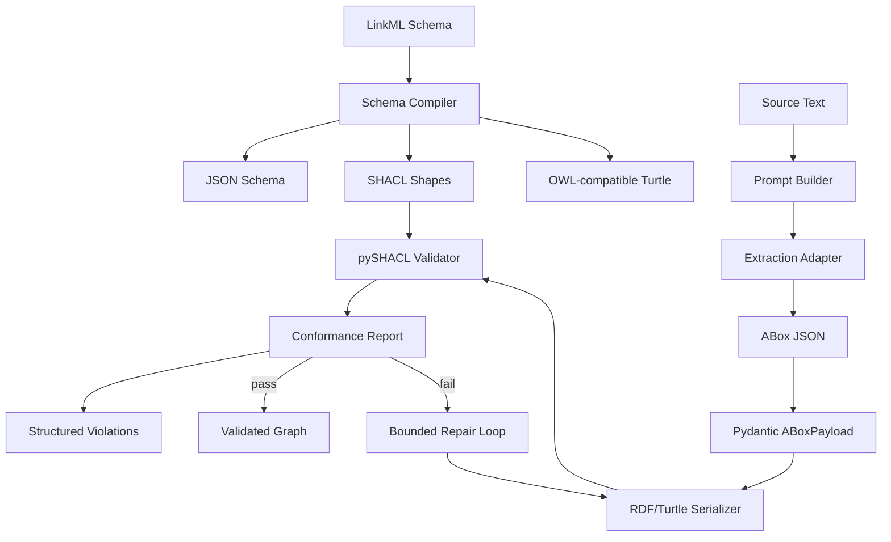

# NeuroOntoGen

NeuroOntoGen is an SDK-first research project for building ontology-generation pipelines that do not trust raw LLM output as the final source of truth.

The project combines flexible extraction with symbolic validation. LLMs can propose ABox facts, but LinkML, Pydantic, RDF, and SHACL define the contract that decides whether those facts are usable.

> Current status: early MVP. The implemented core covers schema compilation, typed ABox models, raw JSON extraction normalization, schema-constrained prompt construction, provider-neutral extraction adapter boundaries, RDF/Turtle serialization, SHACL validation, structured SHACL violation parsing, bounded repair orchestration, and smoke-testable CLI commands. Production LLM SDK integrations, production repairers, OWL reasoning, clustering discovery, and MCP adapters are planned but not yet production features.

## Why this exists

LLMs are useful for reading unstructured text, but they are weak at maintaining ontology discipline by themselves. Common failure modes include:

- inventing entities or relations that are not in the schema;
- mixing classes, instances, and properties;
- omitting required fields;
- changing graph structure when the prompt wording changes;
- producing triples that look plausible but cannot be validated.

NeuroOntoGen treats the LLM as a proposal engine, not as the validator. The validator is code.

## Core idea

```text
LinkML schema
  -> JSON Schema / SHACL / OWL-compatible Turtle artifacts

Typed ABox payload
  -> RDF/Turtle
  -> pySHACL validation
  -> conformance report
```

The MVP starts with a small company-access ontology:

- `Employee`
- `SecureAsset`
- `operates`
- `hasAccessLevel`
- `requiredClearance`

This is intentionally small. It gives the project a reproducible semantic pipeline before adding model providers, repair loops, graph databases, or notebooks.

## What is implemented now

| Area | Status | Notes |
|---|---:|---|
| Python package skeleton | Implemented | Standard `src/` layout with editable install support. |
| LinkML schema fixture | Implemented | `schemas/company_schema.yaml`. |
| Schema compiler wrapper | Implemented | Generates JSON Schema, SHACL, and Turtle artifacts. |
| Pydantic ABox models | Implemented | Validates employees, secure assets, and `operates` relations. |
| RDF/Turtle serializer | Implemented | Converts typed ABox payloads into parseable Turtle. |
| SHACL validation loop | Implemented | Valid and invalid graphs are tested against generated SHACL. |
| Structured SHACL violation parser | Implemented | Validation report graphs are parsed into repair-ready violation objects. |
| Bounded self-repair controller | Implemented | Fake repairer tests cover success, already-valid passthrough, hard failure after retry limits, and repairer exceptions. |
| CLI | Implemented | Typer commands compile schemas and validate Turtle graphs. |
| Runnable examples | Implemented | `examples/company/` includes conforming and non-conforming Turtle smoke fixtures. |
| GitHub Actions CI | Implemented | Runs install, Ruff, pytest, and CLI smoke checks on push and pull request. |
| Raw extraction normalization | Implemented | JSON-like provider output can be parsed into a validated `ABoxPayload`. |
| Schema-constrained prompt builder | Implemented | Versioned prompt artifacts expose role, context, normalization, ontology specification, source text, and output schema sections. |
| Provider-backed extraction boundary | Implemented | A protocol-based adapter builds prompts, calls a provider client, and validates provider output. |
| Production LLM SDK integration | Planned | Concrete OpenAI, Anthropic, or local-model adapters are intentionally deferred. |
| Repair failure taxonomy | Implemented | Repair failures carry machine-readable reasons and error messages. |
| OWL reasoning | Planned | Deferred to avoid blocking the MVP on Java / reasoner integration. |
| Clustering discovery | Planned | Intended for schema discovery, not direct production schema writes. |

## Architecture



The current code implements the solid arrows. Dotted arrows are planned MVP extensions.

## Installation

Clone the repository and install it in editable mode:

```bash
git clone https://github.com/sinonchum/NeuroOntoGen.git
cd NeuroOntoGen
python -m venv .venv
source .venv/bin/activate
python -m pip install -e '.[dev]'
```

The project requires Python 3.10 or newer.

## Quick start

### Compile a LinkML schema

```python
from pathlib import Path

from neuro_onto_gen.schema.compiler import compile_schema

artifacts = compile_schema(
    schema_path=Path("schemas/company_schema.yaml"),
    output_dir=Path("build/schema"),
)

print(artifacts)
```

Expected artifact keys:

```text
json_schema
shacl
turtle
```

### Build and serialize a typed ABox payload

```python
from neuro_onto_gen.core.models import (
    ABoxPayload,
    ExtractedEmployee,
    ExtractedRelation,
    ExtractedSecureAsset,
)
from neuro_onto_gen.core.serializer import serialize_abox_to_turtle

payload = ABoxPayload(
    employees=[ExtractedEmployee(emp_id="E-001", has_access_level=3)],
    secure_assets=[ExtractedSecureAsset(asset_id="VPN", required_clearance=2)],
    relations=[
        ExtractedRelation(
            subject_emp_id="E-001",
            predicate="operates",
            object_asset_id="VPN",
        )
    ],
)

turtle = serialize_abox_to_turtle(payload)
print(turtle)
```

### Validate Turtle against generated SHACL

```python
from pathlib import Path

from neuro_onto_gen.core.validation import validate_abox_turtle
from neuro_onto_gen.schema.compiler import compile_schema

artifacts = compile_schema(Path("schemas/company_schema.yaml"), Path("build/schema"))
report = validate_abox_turtle(turtle, artifacts["shacl"])

print(report.conforms)
print(report.report_text)
```

A valid payload should return `conforms == True`. A graph missing a required property, such as `requiredClearance` on `SecureAsset`, should return `conforms == False` with a SHACL report.

### Use the CLI smoke commands

Compile a schema from the command line:

```bash
neuro-onto-gen compile-schema schemas/company_schema.yaml build/schema
```

Validate a Turtle data graph against generated SHACL shapes:

```bash
neuro-onto-gen validate-turtle examples/company/valid_abox.ttl build/schema/company_schema.shacl.ttl
```

The validation command prints `conforms: true` and exits `0` for conforming graphs. For non-conforming graphs, such as `examples/company/invalid_abox.ttl`, it prints structured violation details and exits `1`.

## Development

Run the test suite:

```bash
.venv/bin/python -m pytest -q
```

Run linting:

```bash
.venv/bin/ruff check .
```

Current local verification target:

```text
34 passed
All checks passed
```

## Repository layout

```text
NeuroOntoGen/
|-- .github/
|   `-- workflows/
|       `-- ci.yml
|-- examples/
|   `-- company/
|       |-- README.md
|       |-- invalid_abox.ttl
|       `-- valid_abox.ttl
|-- docs/
|   |-- DEVELOPMENT_ROADMAP.md
|   |-- PRD.md
|   `-- TECHNICAL_ARCHITECTURE.md
|-- schemas/
|   `-- company_schema.yaml
|-- src/
|   `-- neuro_onto_gen/
|       |-- cli.py
|       |-- core/
|       |   |-- models.py
|       |   |-- prompting.py
|       |   |-- repair.py
|       |   |-- serializer.py
|       |   `-- validation.py
|       `-- schema/
|           `-- compiler.py
|-- tests/
|   |-- fixtures/
|   |   `-- company_schema.yaml
|   |-- test_cli.py
|   |-- test_ci_workflow.py
|   |-- test_core_models.py
|   |-- test_core_serializer.py
|   |-- test_examples.py
|   |-- test_package_import.py
|   |-- test_schema_compiler.py
|   `-- test_shacl_validation.py
`-- pyproject.toml
```

## Design principles

1. Schema first. LinkML and Pydantic define the contract before any model provider is added.
2. LLMs do not validate themselves. Model output must pass deterministic checks.
3. SHACL before persistence. Non-conformant graphs should not enter downstream storage.
4. Repair must be bounded. Automatic repair should have retry limits and clear failure states.
5. SDK before CLI and MCP. Core behavior should be testable as a Python library before it is exposed through adapters.

## Roadmap

### Phase 1: Schema compilation baseline

Implemented:

- Python package skeleton;
- LinkML company schema;
- JSON Schema, SHACL, and Turtle artifact generation;
- tests for generated artifacts.

### Phase 2: ABox modeling and RDF serialization

Partially implemented:

- typed ABox models;
- raw extraction JSON normalization;
- schema-constrained extraction prompt builder;
- provider-backed extraction adapter boundary;
- relation endpoint validation;
- deterministic Turtle serialization;
- RDF graph assertions in tests.

Next:

- concrete production LLM SDK integration;
- provider error taxonomy and retry semantics.

### Phase 3: Validation and repair

Partially implemented:

- pySHACL validation helper;
- structured violation parser;
- bounded self-repair controller with fake repairer tests;
- repair failure taxonomy;
- valid and invalid graph tests.

Next:

- production repairer integration;
- richer repair policy selection.

### Phase 4: Reasoning and evaluation

Planned:

- optional OWL reasoner integration;
- prompt-stability evaluation;
- clustering-based schema discovery;
- benchmark skeleton.

### Phase 5: Usability layer

Partially implemented:

- CLI smoke commands for schema compilation and Turtle validation;
- runnable company example fixtures for conforming and non-conforming Turtle graphs;
- GitHub Actions CI for install, lint, tests, and CLI smoke checks;

Planned:

- reproducible notebook;

## Documentation

The current planning documents are in `docs/`:

- `docs/PRD.md` - product requirements and target use cases;
- `docs/TECHNICAL_ARCHITECTURE.md` - system design and implementation notes;
- `docs/DEVELOPMENT_ROADMAP.md` - staged engineering roadmap.

Some of these documents are still design drafts and may describe planned features that are not implemented yet. The README status table above is the source of truth for current code capability.

## Current limitations

- No production LLM SDK adapter yet.
- No production repairer implementation yet.
- No OWL reasoner integration yet.
- No graph database connector yet.
- CLI coverage is limited to schema compilation and Turtle validation smoke commands.
- The current ontology fixture is a small company-access example, not a general domain model.

These limits are intentional. The first goal is a reproducible, testable semantic validation core.
